# 데이터 모델(ERD) — v1.6.3

> 🧭 [문서 지도](README.md) · ← [05 상태 전이표](05-state-transitions.md) · [07 API 명세서](07-api-spec.md) →

> 💡 **요구사항 정의서 v1.6 · 상태 전이표 v1.6 기준.** Flyway V1 마이그레이션과 JPA 엔티티의 직접 입력이다.
> 💡 **기준 우선순위: "주요 테이블 상세" 표가 원본이며, Mermaid는 그것을 따른다.** 둘이 다르면 상세 표가 맞다.
> 💡 변경은 팀 합의 + 버전 업으로만.

## 변경 이력

| 버전 | 변경 | 근거 |
| --- | --- | --- |
| v1.6.3 | **AP-19·Q-44 반영(2026-08-26)** — quote에 `responder_name`·`responder_title` 추가(고객 응답자의 자기 신고 신원). 계정 없는 응답자라 인증할 수 없으므로 **검증 없는 신고값**이며, 이 사실이 화면·문서에 명시된다 | AP-19, Q-44 (`10-screen-design.md` GAP-09) |
| v1.6.1 | 검수 보정(2026-08-26) — AU-09 잠금 판정 서술 정정(**10분은 판정 윈도우가 아니라 잠금 지속 시간** — 마지막 성공 이후 연속 실패 5회 + 마지막 실패로부터 10분간 차단) · audit_log payload 규약에 견적·주문 이벤트 **dealId 필수** 추가(AC-06 Deal 타임라인 병합 키) | 검수 — AU-09 원문·AC-06 정합 |
| v1.6 | **document_sequence에서 APPLICATION 제외** — doc_type = QUOTE/ORDER 2값, company_id NOT NULL 복귀, 유니크는 일반 UNIQUE로 충분. **application.application_no 컬럼 제거**(신청은 v1에서 번호 미사용, 관리자는 id로 식별. 접수번호가 필요해지면 요구사항(ON-xx)부터 추가 후 전역 스코프로 별도 설계) | A 합의 — 승인 전엔 회사가 없어 행 생성 불가, 스코프 불일치, 미사용 값 |
| v1.6 | quote.status CHECK 값 명시 (DRAFT/SENT/VIEWED/APPROVED/REJECTED/WITHDRAWN/EXPIRED — deal.stage와 동일 처리) | C 2차 2-1 |
| v1.6 | quote_item 값 복사 명시 — name·unit에 "작성 시점 카탈로그 값 복사" 비고. 없으면 product 조인으로 구현되어 PR-04 상품명 변경 시 고객이 본 견적서와 조회본이 달라짐 | C 2차 2-2 |
| v1.6 | notification.type에 EMAIL_FAILED 추가 — 인앱 전용 | Q-35 |
| v1.5 | **인증 3테이블 신설** — refresh_token(다중 기기 Q-28, 플랫폼 관리자 공용 actor_type) · password_reset_token(purpose RESET/INITIAL_SETUP, Q-33·34) · login_attempt(미가입 포함, 테넌트 예외, Q-30) · member.password_changed_at·password_hash NULL 허용 · invitation 재발송 패턴 통일(Q-31) · **task.assignee_member_id 삭제**(Q-29) · 복합 FK 4건 추가 · audit_log 인증 이벤트 6종 · **document_sequence 신설** · quote_view_token.expired_reason +DEAL_LOST · deal.stage CHECK 값 명시 · 인덱스 5건 | 인증 문서 · C 리뷰 · Q-28~34 |
| v1.2 | customer.owner_member_id → **created_by_member_id**(담당→생성자 기록, 접근 판정 제외) · product UNIQUE(company_id, name) · company.business_no UNIQUE | SC-03 재정의 · 중복 방지 |

## 설계 원칙

| 원칙 | 내용 | 근거 |
| --- | --- | --- |
| 테넌트 격리 | **집계 루트**(customer·deal·product·quote·orders·activity·audit_log·notification 등)는 `company_id` 직접 보유. **자식 테이블**(customer_contact·quote_item·quote_view_token·customer_inquiry·order_item·task·notification_setting·refresh_token·password_reset_token)은 부모 경유 격리. **예외: login_attempt는 company_id 없음** — 로그인 시점엔 회사 불명(미가입·플랫폼 관리자 포함) | SC-01 |
| 복합 FK | **규칙: 부모가 둘 이상인 테이블은 그 부모들이 서로 다른 회사일 수 있다 → 복합 FK로 차단.** deal→customer · deal→member · quote→deal · orders→quote · activity→deal · activity→member · notification→member · invitation→member는 `(company_id, id)` 복합 FK. 참조 대상에 `UNIQUE(company_id, id)` 보조 유니크 | SC-01 |
| 조회 범위 파생 | 견적·주문·상담 기록·할 일의 접근 범위는 **Deal에서 파생**(담당 기준은 deal.assignee_member_id 하나). 고객사는 회사 공유(SC-03). activity.author_member_id는 수정·삭제 권한(AC-04·05) 판정용이지 조회 경로가 아니다 | SC-02~06 |
| PK | 전 테이블 UUID. 표시 번호(Q-2608-014 등)는 별도 컬럼 | 컨벤션 §2.5 |
| 상태 | 상태 전이표 v1.6의 영문 코드를 문자열 enum으로 저장 | 전이표 v1.6 |
| 금액 | BIGINT, 원 단위 정수. 소수·통화 컬럼 없음 | Q-12 |
| 공통 컬럼 | 전 테이블 `created_at`·`updated_at` (아래 표기 생략). `quote`·`deal`은 `version` (낙관적 락, JPA @Version) | 리뷰 7 |
| 소프트 삭제 | 고객사·Deal·상담 기록은 `deleted_at` | AC-11 |
| 스냅샷 | 주문 항목은 FK 없이 값 복사. 견적 항목엔 작성 시점 카탈로그 **단가·품목명·단위**를 값 복사 (PR-04 변경 무영향) | OD-04~05, QT-24, C 2차 2-2 |

## 테이블 한눈에 (25개)

| 영역 | 테이블 | 역할 |
| --- | --- | --- |
| 플랫폼 | `application` | 가입 신청 — 반려 이력 보존 (Q-15) |
| 플랫폼 | `platform_admin` | 플랫폼 관리자 계정 — 구성원과 별도 (AU-08) |
| 테넌트 | `company` | 회사 (운영/정지) — 신청서와 1:1 |
| 테넌트 | `member` | 구성원 (역할·활성·비밀번호) |
| 테넌트 | `invitation` | 초대 (7일 만료, 발송자·이력, 재발송=새 행 Q-31) |
| 인증 | `refresh_token` | 세션 원본 — 즉시 차단의 실체 (AU-02·10, 다중 기기 Q-28) |
| 인증 | `password_reset_token` | 비밀번호 재설정 (AU-05 — RESET 30분 / 설정 7일, 활성 1개) |
| 인증 | `login_attempt` | 로그인 시도 — 잠금 판정 (AU-09, 미가입 포함, 테넌트 예외) |
| 영업 | `customer` | 고객사 |
| 영업 | `customer_contact` | 고객사 담당자 (대표 지정) |
| 영업 | `deal` | Deal (고정 6단계, 낙관적 락) |
| 카탈로그 | `product` | 상품 (판매 중지 포함) |
| 견적 | `quote` | 견적 (7상태, 금액 3분리, 낙관적 락) |
| 견적 | `quote_item` | 견적 항목 (작성 시점 단가, QT-29 확장 지점) |
| 고객 승인 | `quote_view_token` | 열람 링크 (견적당 활성 1개, 만료 사유) — **D 소유** (경계 합의) |
| 고객 승인 | `customer_inquiry` | 고객 문의 (기록만, Q-20) — **D 소유** (AP-15) |
| 주문 | `orders` | 주문 (상태 없음, 견적과 1:1) |
| 주문 | `order_item` | 주문 항목 (스냅샷 복사) |
| 이력 | `activity` | 상담 기록 (수동, AC-01~05) |
| 이력 | `task` | 다음 할 일 (AC-09 — 배정 컬럼 없음, Deal 따라 이동 Q-29) |
| 이력 | `audit_log` | 자동 이벤트·변경 감사 (AC-07·11) |
| 공통 | `document_sequence` | 표시 번호 채번 — 회사·문서종류·월별 last_seq (FOR UPDATE) |
| 알림 | `notification` | 인앱 알림 (Q-23, NT-03~05·08·10·12) |
| 알림 | `email_log` | 시스템 메일 발송 기록 — 중복 발송 방지 (NT-01~06·10·13, 설정 on 건 포함) |
| 알림 | `notification_setting` | 구성원별 메일 수신 설정 (NT-07) |

## ERD 다이어그램

> 💡 **다이어그램 색상 규칙**: 색 = 담당자가 아니라 **데이터 묶음**(같은 색 = 데이터로 한 덩어리). 담당이 색 그룹과 다른 예외는 머리글에 라벨로 표기 — 열람 링크·고객 문의는 견적의 자식 데이터라 견적 색이지만 **담당은 D(이준형)**. 담당 전체 목록은 업무 분담 v2.0 문서가 기준.

```mermaid
erDiagram
    application ||..o| company : "승인 시 생성 1:0..1"
    company ||--o{ member : ""
    company ||--o{ invitation : ""
    company ||--o{ customer : ""
    company ||--o{ product : ""
    customer ||--o{ customer_contact : ""
    customer ||--o{ deal : ""
    member ||--o{ deal : "담당"
    deal ||--o{ quote : ""
    deal ||--o{ activity : ""
    deal ||--o{ task : ""
    quote ||--o{ quote_item : ""
    quote ||--o{ quote_view_token : ""
    quote ||--o{ customer_inquiry : ""
    quote ||--o| orders : "승인 견적 1:0..1"
    orders ||--o{ order_item : "스냅샷"
    company ||--o{ audit_log : ""
    company ||--o{ document_sequence : "채번"
    member ||--o{ notification : "수신"
    member ||--o{ notification_setting : ""
    member ||--o{ refresh_token : "세션"
    platform_admin ||--o{ refresh_token : "관리자 세션"
    member ||--o{ password_reset_token : ""
    member ||..o{ login_attempt : "가입된 경우만"
    application {
        uuid id PK
        string company_name
        string business_no "회사로 복사"
        string email
        string status "PENDING/APPROVED/REJECTED"
        string reject_reason "이력 보존 Q-15"
        timestamp decided_at
    }
    company {
        uuid id PK
        uuid application_id FK "UNIQUE - 승인 멱등"
        string name
        string business_no UK "신청서에서 복사, 전역 유일"
        string status "ACTIVE/SUSPENDED"
        string suspend_reason
    }
    platform_admin {
        uuid id PK
        string email UK
        string password_hash
        string status
    }
    member {
        uuid id PK
        uuid company_id FK
        string email "UNIQUE lower(email)"
        string password_hash "NULL 허용 Q-33"
        string name
        string phone
        string role "COMPANY_ADMIN/SALES_REP"
        string status "ACTIVE/INACTIVE"
        timestamp password_changed_at "AU-04-05 토큰 유효 기준"
    }
    invitation {
        uuid id PK
        uuid company_id FK
        uuid invited_by_member_id FK
        string email
        string role
        string token_hash UK
        string status "PENDING/ACCEPTED/CANCELED/EXPIRED"
        timestamp expires_at "7일 MB-04"
        timestamp accepted_at
        timestamp canceled_at
        timestamp expired_at
        string expired_reason "TIME/RESENT Q-31"
    }
    customer {
        uuid id PK
        uuid company_id FK
        uuid created_by_member_id FK "생성자 기록 — 접근 판정 아님"
        string name
        string industry
        string size
        string note
        timestamp deleted_at
    }
    customer_contact {
        uuid id PK
        uuid customer_id FK
        string name
        string title
        string email
        string phone
        boolean is_primary "대표 1명 부분 유니크"
    }
    deal {
        uuid id PK
        uuid company_id FK
        uuid customer_id FK "복합 FK"
        uuid assignee_member_id FK "복합 FK SC-02"
        string title
        string stage "LEAD/CONSULT/QUOTE/NEGOTIATION/WON/LOST"
        bigint expected_amount
        date due_date
        string lost_reason
        string lost_from_stage "재개용 DL-12"
        int version "낙관적 락"
        timestamp deleted_at
    }
    product {
        uuid id PK
        uuid company_id FK
        string name "UNIQUE(company_id, name)"
        string unit
        bigint unit_price
        string status "ACTIVE/DISCONTINUED"
        string description
    }
    quote {
        uuid id PK
        uuid company_id FK
        uuid deal_id FK "복합 FK"
        string quote_no "UNIQUE(company_id, quote_no)"
        string status "DRAFT/SENT/VIEWED/APPROVED/REJECTED/WITHDRAWN/EXPIRED"
        string vat_mode "EXCLUDED 기본 Q-16"
        bigint supply_amount "서버 계산만"
        bigint vat_amount
        bigint total_amount
        date valid_until "= 링크 만료 Q-17"
        string terms
        uuid cloned_from_quote_id FK "복제 계보 Q-18"
        timestamp sent_at
        timestamp first_viewed_at "AP-07"
        timestamp responded_at
        string reject_reason "AP-10"
        string responder_name "AP-19 자기 신고 - 검증 없음"
        string responder_title "직책 선택"
        int version "낙관적 락"
    }
    quote_item {
        uuid id PK
        uuid quote_id FK
        uuid product_id FK "null=직접입력"
        string name "작성 시점 카탈로그 값 복사 - PR-04 변경 무영향"
        string unit "작성 시점 값 복사"
        int quantity "CHECK > 0"
        bigint unit_price "CHECK >= 0"
        bigint amount
        bigint catalog_price_at_creation "QT-24 · QT-29 확장 지점"
        int sort_order "CHECK >= 0"
    }
    quote_view_token {
        uuid id PK
        uuid quote_id FK "활성 1개 부분 유니크 AP-03"
        uuid recipient_contact_id FK "수신인 AP-13"
        string token_hash UK "해시만 저장"
        string status "ACTIVE/RESPONDED/EXPIRED"
        string expired_reason "TIME/MANUAL/WITHDRAWN/RESENT/DEAL_LOST"
        timestamp expires_at "valid_until 23:59:59 KST"
    }
    customer_inquiry {
        uuid id PK
        uuid quote_id FK
        string content "기록만 Q-20"
    }
    orders {
        uuid id PK
        uuid company_id FK
        uuid quote_id FK "UNIQUE - 1견적 1주문 · 복합 FK"
        string order_no "UNIQUE(company_id, order_no)"
        bigint supply_amount "스냅샷 복사"
        bigint vat_amount
        bigint total_amount
        date start_date "OD-10"
        date delivery_date
    }
    order_item {
        uuid id PK
        uuid order_id FK
        string name "FK 없이 값 복사"
        string unit
        int quantity
        bigint unit_price
        bigint amount
    }
    activity {
        uuid id PK
        uuid company_id FK
        uuid deal_id FK
        uuid author_member_id FK "본인만 수정 AC-04"
        string channel "CALL/MEETING/EMAIL"
        string content
        timestamp occurred_at
        timestamp deleted_at
    }
    task {
        uuid id PK
        uuid deal_id FK
        string content
        date due_date "AC-09"
        timestamp done_at
    }
    audit_log {
        uuid id PK
        uuid company_id FK
        string entity_type
        uuid entity_id
        string event_type "STAGE_MOVED 등"
        string actor_type "MEMBER/PLATFORM_ADMIN/CUSTOMER_LINK/SYSTEM"
        uuid actor_id
        timestamp occurred_at
        jsonb payload "보안정보 저장 금지"
    }
    notification {
        uuid id PK
        uuid company_id FK
        uuid recipient_member_id FK
        string type "NT-03~05·10·12"
        string message
        string ref_type
        uuid ref_id
        timestamp read_at "null=안 읽음"
    }
    email_log {
        uuid id PK
        uuid company_id FK "플랫폼 발송은 null"
        string template_type "NT-01~06·10·13 전체"
        string recipient_email
        string ref_type
        uuid ref_id
        string status "SCHEDULED/SENT/FAILED"
        timestamp sent_at
    }
    notification_setting {
        uuid id PK
        uuid member_id FK
        string type
        boolean enabled "행 없으면 기본 ON"
    }
    refresh_token {
        uuid id PK
        string actor_type "MEMBER/PLATFORM_ADMIN"
        uuid member_id FK "null 허용 - 둘 중 하나 CHECK"
        uuid platform_admin_id FK "관리자 세션"
        string token_hash UK "해시만 저장"
        string status "ACTIVE/REVOKED"
        string revoked_reason "ROTATED/LOGOUT/PASSWORD_CHANGED/MEMBER_DEACTIVATED/COMPANY_SUSPENDED/REUSE_DETECTED"
        timestamp expires_at "미유지 12h / 유지 14d Q-32"
        timestamp last_used_at
        timestamp revoked_at
    }
    password_reset_token {
        uuid id PK
        uuid member_id FK "활성 1개 부분 유니크"
        string purpose "RESET/INITIAL_SETUP Q-33"
        string token_hash UK "해시만 저장"
        string status "ACTIVE/USED/EXPIRED"
        timestamp expires_at "RESET 30분 / INITIAL_SETUP 7일 Q-34"
        timestamp used_at
    }
    document_sequence {
        uuid id PK
        uuid company_id FK "NOT NULL"
        string doc_type "QUOTE/ORDER"
        string year_month "2608"
        int last_seq "FOR UPDATE 채번"
    }
    login_attempt {
        uuid id PK
        string email "lower() - 미가입도 기록"
        string actor_type "MEMBER/PLATFORM_ADMIN Q-30"
        uuid member_id FK "null=미가입 또는 관리자"
        boolean success
        string ip_address "IPv6 45자"
        timestamp attempted_at "AU-09 판정"
    }
```

## 주요 테이블 상세 (기준 원본)

### quote (견적)

| 컬럼 | 타입 | 제약 | 비고 |
| --- | --- | --- | --- |
| id | uuid | PK |  |
| company_id | uuid | FK, NOT NULL |  |
| deal_id | uuid | 복합 FK (company_id, deal_id), NOT NULL | Deal당 N건 (QT-18) |
| quote_no | varchar | UNIQUE(company_id, quote_no) | 표시용 |
| status | varchar | NOT NULL, CHECK | DRAFT/SENT/VIEWED/APPROVED/REJECTED/WITHDRAWN/EXPIRED (전이표 §6) |
| vat_mode | varchar | NOT NULL, 기본 EXCLUDED | Q-16 |
| supply/vat/total_amount | bigint | NOT NULL, CHECK ≥ 0 | 서버 계산값만 (QT-08·22) |
| valid_until | date | NOT NULL | = 링크 만료 (Q-17) |
| terms | text |  | QT-10 |
| cloned_from_quote_id | uuid | FK self, NULL | Q-18 계보 · QT-28 대체 견적 이동 |
| sent_at / first_viewed_at / responded_at | timestamptz |  | AP-06·07 |
| reject_reason | varchar |  | AP-10 |
| **responder_name / responder_title** | varchar | NULL | **AP-19 — 승인·반려한 사람이 직접 밝힌 이름·직책. 계정이 없어 인증 불가하므로 `검증 없는 자기 신고`다(Q-44). 응답 전에는 NULL** |
| version | int | NOT NULL | 낙관적 락 |

### quote_view_token (열람 링크)

| 컬럼 | 타입 | 제약 | 비고 |
| --- | --- | --- | --- |
| quote_id | uuid | FK, **부분 유니크 `WHERE status='ACTIVE'`** | 견적당 활성 1개 (AP-03) |
| recipient_contact_id | uuid | FK | AP-13 재발송 시 새 행 |
| token_hash | varchar | UNIQUE | 원문 미저장 |
| status | varchar | CHECK | ACTIVE/RESPONDED/EXPIRED |
| expired_reason | varchar | NULL | TIME/MANUAL/WITHDRAWN/RESENT/**DEAL_LOST**(Deal 실패 시 자동 만료 — 전이표 §5) |
| expires_at | timestamptz | NOT NULL | valid_until 당일 23:59:59 KST까지 유효 |

### orders (주문)

| 컬럼 | 타입 | 제약 | 비고 |
| --- | --- | --- | --- |
| quote_id | uuid | 복합 FK + **UNIQUE** | 1견적 1주문 (OD-03) — deal은 quote 경유 조회 |
| order_no | varchar | UNIQUE(company_id, order_no) | OD-07 |
| supply/vat/total_amount | bigint | NOT NULL | 전환 시점 복사 (OD-04) |
| start_date / delivery_date | date | NULL | OD-10 · 상태 컬럼 없음 (Q-09·24) |

### member (구성원)

| 컬럼 | 타입 | 제약 | 비고 |
| --- | --- | --- | --- |
| email | varchar | **UNIQUE lower(email) 전역** | Q-14 |
| password_hash | varchar | **NULL 허용** | Q-33 — 승인 직후 미설정 계정. NULL이면 로그인 자연 실패(LOGIN_FAILED, 별도 상태 없음) |
| name | varchar | NOT NULL | AU-07 |
| phone | varchar | NULL | AU-07 |
| role / status | varchar | NOT NULL, CHECK | MB-11은 서비스 레이어 |
| password_changed_at | timestamptz | NULL | AU-04·05 — 이 시각 이후 발급 토큰만 유효. 2차 Redis 캐시 무효화 기준 |

### 인증 3테이블

| 테이블 | 핵심 제약 | 비고 |
| --- | --- | --- |
| refresh_token | token_hash UNIQUE · status CHECK(ACTIVE/REVOKED) · revoked_reason CHECK 6종(REUSE_DETECTED 포함 — 회전된 토큰 재사용 감지 시 세션 전체 폐기) · **부분 유니크 없음** · **CHECK: member_id·platform_admin_id 중 정확히 하나** | 다중 기기 허용(Q-28) · 회전=기존 행 REVOKED(ROTATED)+새 행 · EXPIRED 상태 없음(expires_at 비교 판정) · 플랫폼 관리자 세션도 이 테이블(actor_type) · 만료 30일 후 삭제 배치 |
| password_reset_token | token_hash UNIQUE · **부분 유니크 (member_id) WHERE status='ACTIVE'** · **purpose CHECK(RESET/INITIAL_SETUP)** | RESET 30분 / INITIAL_SETUP 7일 (Q-34) · 재요청=기존 행 EXPIRED+새 행 · **사용 시 해당 구성원 refresh_token 전 행 폐기** · 승인 통보 링크가 INITIAL_SETUP (Q-33) |
| login_attempt | email lower() 정규화 · actor_type CHECK(MEMBER/PLATFORM_ADMIN) · member_id NULL 허용 | 미가입 이메일도 기록(SC-09 — 잠김 여부로 계정 존재 노출 방지) · 30일 후 삭제 배치 · **company_id 없음(격리 예외)** |

### document_sequence (표시 번호 채번)

| 컬럼 | 타입 | 제약 | 비고 |
| --- | --- | --- | --- |
| company_id | uuid | FK, **NOT NULL** | 회사별 채번 — APPLICATION은 A 합의로 제외 (신청은 번호 미사용, id 식별) |
| doc_type | varchar | NOT NULL, CHECK | QUOTE / ORDER |
| year_month | char(4) | NOT NULL | 월별 리셋 (예: 2608) |
| last_seq | int | NOT NULL | `SELECT ... FOR UPDATE` → +1 → 번호 조립. 행 없으면 INSERT |
| 유니크 | — | **UNIQUE (company_id, doc_type, year_month)** | company_id NOT NULL이라 일반 유니크로 충분 |

> quote_no·order_no의 `UNIQUE(company_id, no)`는 최종 방어선으로 유지. `MAX+1 재시도` 방식은 폐기(문자열 파싱·재시도 로직 3곳 중복).

### audit_log (감사 로그)

| 컬럼 | 타입 | 제약 | 비고 |
| --- | --- | --- | --- |
| company_id | uuid | FK, **NOT NULL** | 회사 불명 이벤트(로그인 성공·실패)는 여기 안 넣고 login_attempt 전담 |
| entity_type / entity_id | varchar / uuid | NOT NULL | 모든 엔티티 |
| event_type | varchar | NOT NULL | STAGE_MOVED 등 + 인증 6종: PASSWORD_CHANGED · PASSWORD_RESET · SESSION_REVOKED · MEMBER_DEACTIVATED · MEMBER_REACTIVATED · ROLE_CHANGED |
| actor_type / actor_id | varchar / uuid | NOT NULL / NULL | MEMBER/PLATFORM_ADMIN/CUSTOMER_LINK/SYSTEM |
| occurred_at | timestamptz | NOT NULL |  |
| payload | jsonb |  | **비밀번호·토큰·해시 저장 금지** — 인증 이벤트 포함으로 더 중요해짐 · 견적·주문 이벤트에는 **dealId 포함**(AC-06 Deal 타임라인 병합 키, v1.6.1) |

### notification (인앱 알림) · email_log (메일 발송 기록)

| 테이블 | 핵심 제약 | 비고 |
| --- | --- | --- |
| notification | 인덱스 (recipient_member_id, read_at) | 읽은 알림 90일 후 삭제 배치 (보존 정책) |
| email_log | **UNIQUE(template_type, ref_id, recipient_email)** | 리마인드(NT-05)·임박(NT-06) 배치 재실행 시 이중 발송을 DB가 차단 |
| notification_setting | UNIQUE(member_id, type) | 메일 채널에만 적용 (Q-23) |

## 제약조건 모음

| 분류 | 내용 |
| --- | --- |
| 복합 FK | deal→(company_id, customer_id) · deal→(company_id, assignee_member_id) · quote→(company_id, deal_id) · orders→(company_id, quote_id) · **activity→(company_id, deal_id) · activity→(company_id, author_member_id) · notification→(company_id, recipient_member_id) · invitation→(company_id, invited_by_member_id)**. 참조 대상에 UNIQUE(company_id, id) |
| 부분 유니크 | 견적당 활성 링크 1개 · 고객사당 대표 담당자 1명 `WHERE is_primary` · 회사·이메일당 대기 초대 1개 `WHERE status='PENDING'` · **구성원당 활성 재설정 토큰 1개 `WHERE status='ACTIVE'`** (refresh_token에는 걸지 않음 — 다중 기기, Q-28) |
| 회사 내 유일 | quote_no · order_no · **product.name (판매 중지 포함 — 재등록 대신 판매 재개 사용)** |
| 전역 유일 | member.email `lower(email)` · platform_admin.email · **company.business_no (사업자번호당 테넌트 1개 — 중복 가입을 DB가 최후 방어. 회사 이름은 유니크 아님: 동명 상호 합법)** — application.business_no는 재신청 허용(Q-15)이라 유니크 금지 |
| CHECK | 금액 ≥ 0 · 수량 > 0 · sort_order ≥ 0 · 상태값 enum · **invitation.role** · **deal.stage IN (LEAD, CONSULT, QUOTE, NEGOTIATION, WON, LOST)** · **quote.status IN (DRAFT, SENT, VIEWED, APPROVED, REJECTED, WITHDRAWN, EXPIRED)** — 마이그레이션에서 값 명시 |
| 인덱스 | 모든 FK 컬럼 · notification(recipient_member_id, read_at) · audit_log(company_id, occurred_at) · **refresh_token(member_id, status) · login_attempt(email, attempted_at DESC) · task(deal_id, done_at) · deal(company_id, assignee_member_id, stage)** |

## DB로 못 막는 것 (서비스 레이어 담당)

| 규칙 | 이유 |
| --- | --- |
| 마지막 기업 관리자 비활성화 금지 (MB-11) | 집계 조건 |
| 상태 전이 규칙 전체 | 전이는 엔티티 메서드에서 (컨벤션 §4) |
| 진행 중 Deal 있는 고객사 삭제 금지 (CU-08) | 소프트 삭제라 FK로 안 막힘 |
| 판매 중지 상품 새 견적 추가 금지 (PR-06) | 기존 견적 항목 FK는 유지되어야 함 |
| audit_log payload에 비밀번호·토큰·해시 금지 | 애플리케이션 규약 — 인증 이벤트 포함으로 더 중요 |
| SC-09를 인증 경로에도 적용 — 로그인 실패·재설정 요청·잠금 여부의 응답이 계정 존재로 갈리면 안 됨 | 순수 응답 규약 |
| activity 조회 권한은 Deal에서 파생 — author_member_id는 수정·삭제 판정용 | 작성자 컬럼이 별도 접근 경로가 되지 않도록 |
| 열람 링크 수신인은 해당 견적의 고객사 소속 담당자여야 함 (AP-13 재발송 특히) | customer_contact에 company_id가 없어 복합 FK 불가 — CONTACT_NOT_IN_CUSTOMER |
| 비밀번호 변경·재설정 완료 시 해당 구성원 refresh_token 전 행 폐기 | 집계 조건 |
| 로그인 실패 잠금 판정 — 마지막 성공 이후 **연속 실패 5회 이상**이고 **마지막 실패로부터 10분 이내**면 차단 (AU-09 — 10분은 잠금 지속 시간이지 판정 윈도우가 아님, v1.6.1 정정) | 시간 조건 집계 |

## 다음 단계

| 순서 | 할 일 | 담당 |
| --- | --- | --- |
| 1 | ✅ v1.6 확정 (채번 APPLICATION 제외 · status CHECK · 값 복사 비고) | 전원 |
| 2 | Flyway V1 마이그레이션 + JPA 엔티티 25개 → 깃 PR | 김대연 |
| 3 | API 명세 자기 도메인 검토 → 확정 → 구현 착수 | A·B·C·D |
